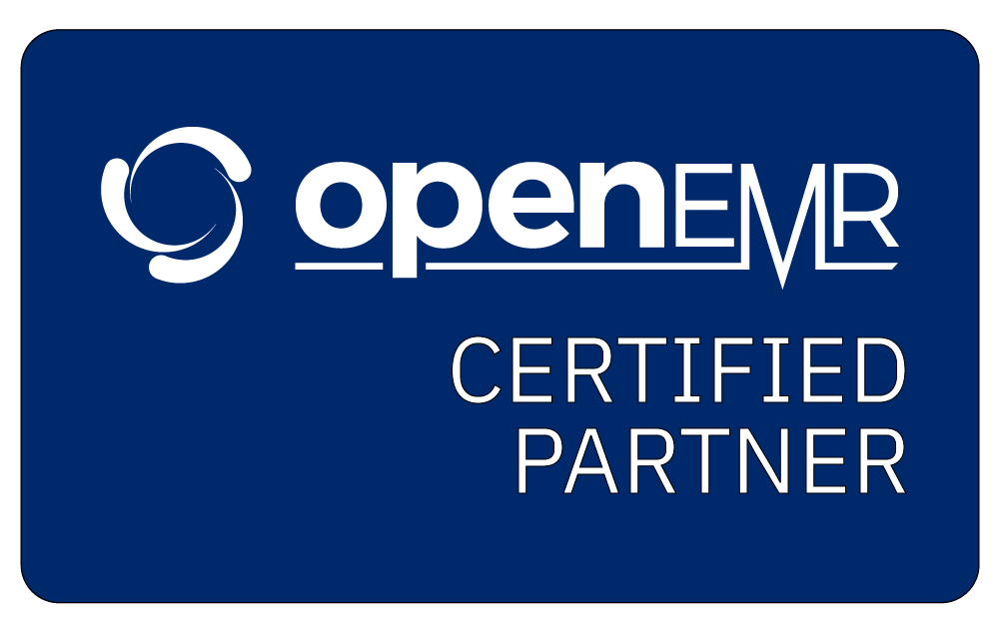

Providence is a leader in the OpenEMR community - a practical solution for solo and small practices with a small IT budget.

<!--more-->

Providence Healthtech - your trusted partner for OpenEMR installation, training, management, customization,and ongoing support, specializing in solo and small medical practices.

With years of experience within the OpenEMR community, Providence stands as a beacon of expertise in the open-source EMR space. We are proud that our CEO has served as an OpenEMR project administrator for many years, brining unparalleled insight and proficiency to every aspect of our service offerings.

At Providence, we are not just service providers – we are subject matter experts of the OpenEMR software. Our deep understanding of the platform allows us to tailor solutions that precisely meet the needs of solo practitioners and small medical practices.

From initial installation and customization to comprehensive training programs, we ensure that you and your staff are equipped with the knowledge and tools needed to maximize the benefits of OpenEMR. And with our ongoing support services, you can rest assured knowing that assistance is readily available whenever you need it.

### What can a Providence-managed OpenEMR setup provide?

**Problem Lists**
: Efficiently manage patient conditions for optimal treatment planning.

**Allergy and Medication Management**
: Safeguard patient health with robust tracking capabilities.

**Customizable Forms**
: Tailor forms to capture critical data points specific to your practice.

**HL7 and FHIR Compatibility**
: Seamlessly integrate with other systems for enhanced interoperability.

**ONC Certification**
: Trust in a system that meets stringent industry standards for quality and security.

Schedule a consultation with our expert team and unlock the full potential of OpenEMR for your practice.